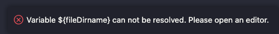

# **PROCESSAMENTO GRÁFICO - UNISINOS 2023/1**

## **DEVELOPMENT ENVIRONMENT**

### **SYSTEM**

- macOS Ventura 13

### **IDEA**

- Visual Studio Code
  - Version: 1.78.0 (Universal)
  - Node.js: 16.17.1
  - OS: Darwin x64 22.4.0

### **DEPENDENCIES**

- GLFW
- GLAD
- GLM

## **PROJECTS**

1. hello-triangle
1. hello-triangle-with-shaders
1. hello-triangle-with-glm
1. list_a (`default`)

## **RUN**

1. Make sure to have all project dependencies installed
1. On project root, press `cmd+shift+B`, choose a project on prompt to build
1. Run `./${project}/app` on terminal

> In case of this error, open any `.cpp` file an try again. 
