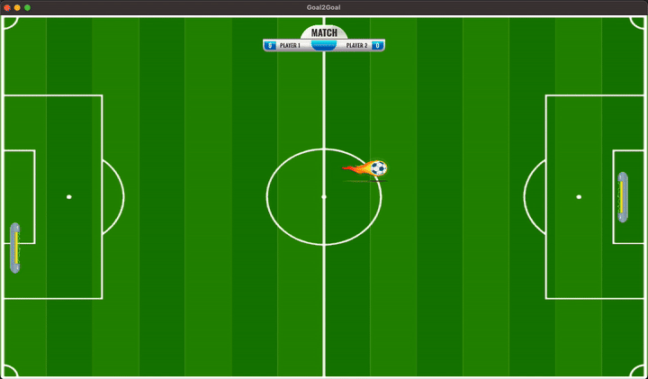

# Goal2Goal

## Trabalho Prático - Processamento Gráfico GA

O objetivo deste trabalho é desenvolver um protótipo de jogo 2D aplicando os conceitos vistos
em aula. Para o Grau A, os conhecimentos sobre desenho de primitivas, transformações
geométricas, câmera 2D e mapeamento de textura serão explorados. Sugere-se como
inspiração para pesquisa para a escolha do tema e mecânicas jogos de fliperama,
especialmente os mais antigos.

