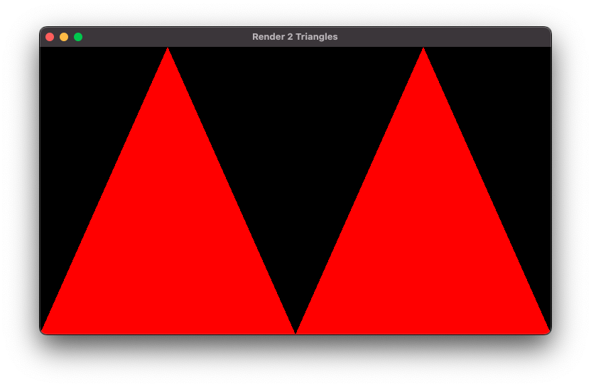
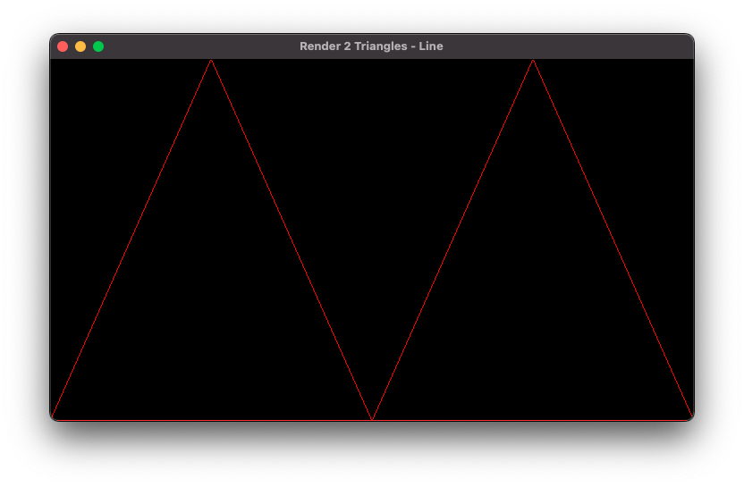
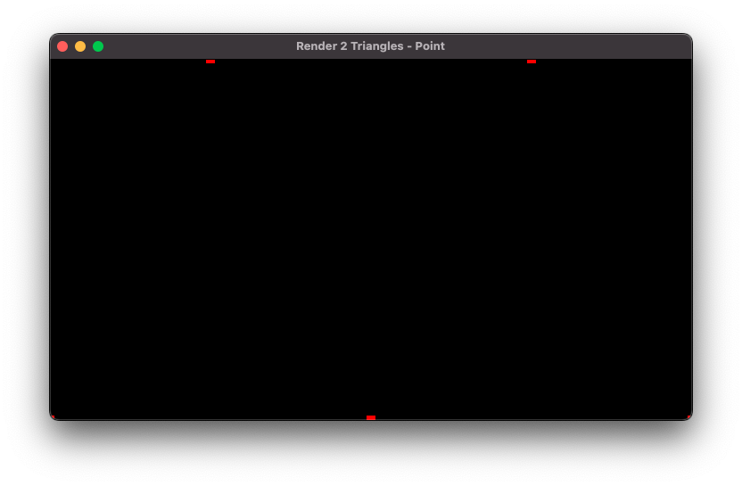
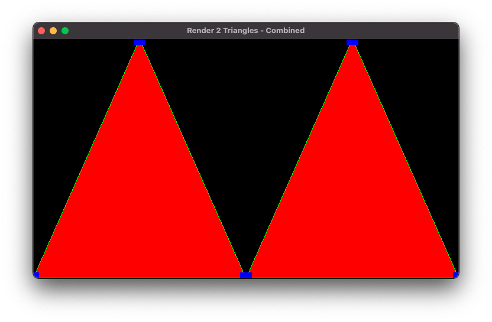
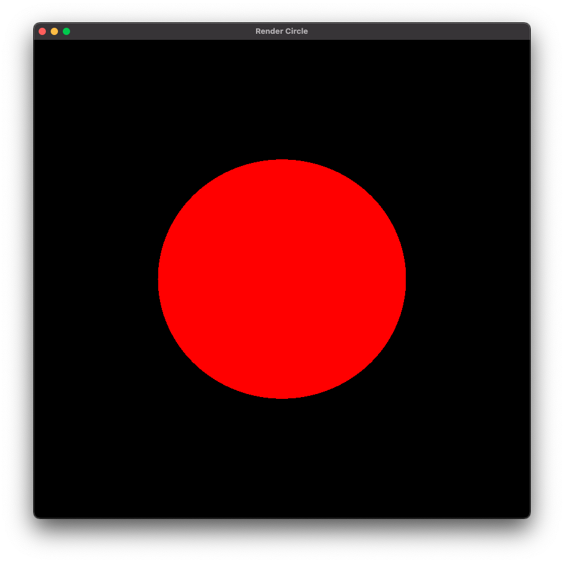
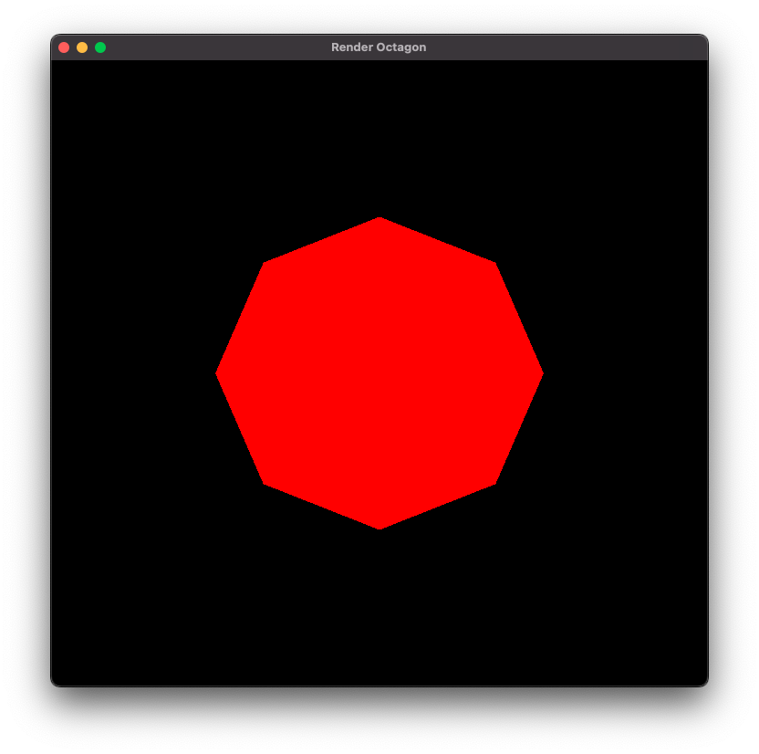
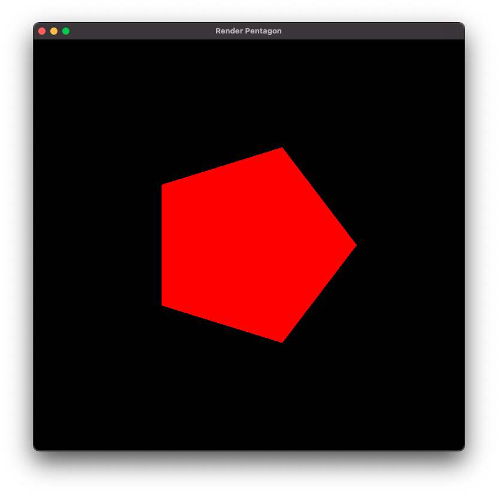
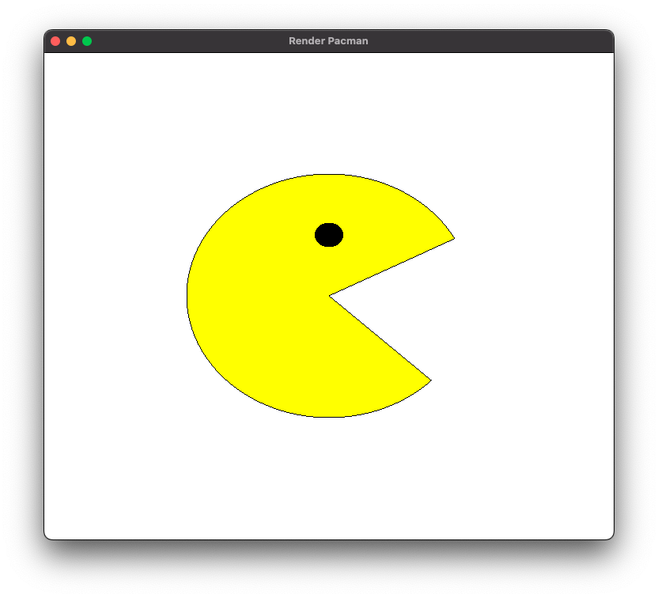
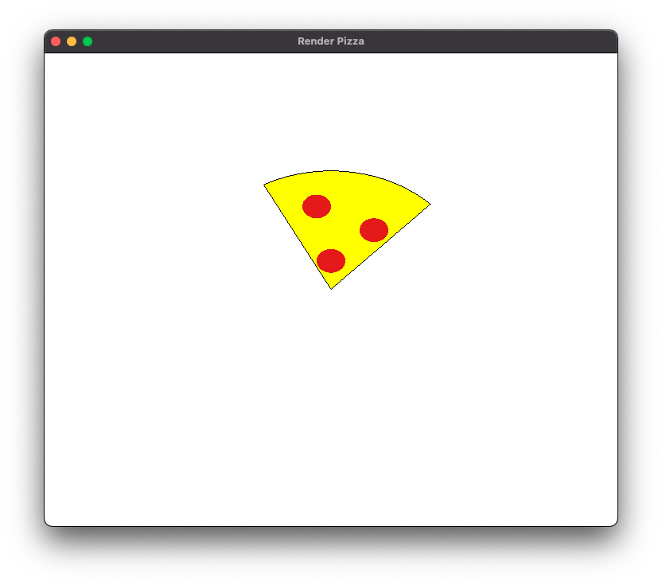

# Lista 1

## Questões teóricas

### 1 - O que é a GLSL? Quais os dois tipos de shaders são obrigatórios no pipeline programável da versão atual que trabalhamos em aula e o que eles processam?

A `OpenGL Shading Language` é uma linguagem de programação utilizada para escrever `shaders` em `OpenGL`

É considerada uma linguagem de alto nível que permite aos desenvolvedores especificar como as etapas do pipeline gráfico devem ser executadas. Os dois `shaders` obrigatórios são o `Vertex Shader` e `Fragment Shader`

O `VS` transforma os vértices de objetos 3D em pontos 2D, já o `FS` é responsável por calcular a cor de cada pixel na tela com base nas transformações do `VS`

### 2 - O que são primitivas gráficas? Como fazemos o armazenamento dos vértices na OpenGL?

Primitivas gráficas são formas básicas utilizadas para criar objetos e cenas em um ambiente de computação gráfica, as mais básicas são: linhas, pontos e triângulos

Na `OpenGL`, os vértices que formam essas primitivas gráficas são armazenados em `vertex buffers`, que são espaços de memória da `GPU`

### 3 - Explique o que é VBO, VAO e EBO, e como se relacionam (se achar mais fácil, pode fazer um gráfico representando a relação entre eles)

`VBO` - `Vertex Buffer Object`: é um buffer que armazena os dados dos vértices, como a posição, cor e outros dados

`VAO` - `Vertex Array Object`: é um objeto que armazena informações sobre como os dados dos vértices estão organizados e onde estão armazenados nos `vertex buffers`. Esses dados dos vértices permitem ao OpenGL interpretar cada vértice de forma adequada para construir a cena

`EBO` - `Element Buffer Object`: é um buffer que armazena os índices dos vértices que compõem as primitivas gráficas. Permite que as primitivas gráficas compartilhem vértices, evitando a duplicação de mesmos pontos

Os `VBOs`, `VAOs` e `EBOs` atuam em conjunto para definir e renderizar primitivas gráficas na `OpenGL`. Um `VAO` pode referenciar um ou mais `VBOs`, indicando onde cada atributo de vértice está armazenado e como interpretar. O `VAO` também pode referenciar um `EBO` para indicar quais índices dos vértices devem ser usados para criar as primitivas gráficas

### 4 - Analise o código fonte do projeto Hello Triangle. Localize e relacione os conceitos de shaders, VBOs e VAO apresentados até então

Não precisa entregar nada neste exercício

## Questões práticas

No arquivo [main.cpp](./main.cpp#L54) no método `main` remova o comentário da linha de render desejada, [compile e execute o app](../README.md#L29)

### 5 - Faça o desenho de 2 triângulos na tela. Desenhe eles

1. [Apenas com o polígono preenchido](./two-triangles/main.cpp)
    
2. [Apenas com contorno](./two-triangles-line/main.cpp)
    
3. [Apenas como pontos](./two-triangles-point/main.cpp)
    
4. [Com as 3 formas de desenho juntas](./two-triangles-all/main.cpp)
    

### 6 - Faça o desenho de um círculo na tela, utilizando a equação paramétrica do círculo para gerar os vértices. Depois disso

0. [Desenhe um circulo](./circle/main.cpp)
    
1. [Desenhe um octágono](./octagon/main.cpp)
    
2. [Desenhe um pentágono](./pentagon/main.cpp)
    
3. [Desenhe um pac-man!](./pacman/main.cpp)
    
4. [Desenhe uma fatia de pizza](./pizza/main.cpp)
    
5. [DESAFIO: desenhe uma “estrela”]()

### 7 - Desenhe uma espiral
