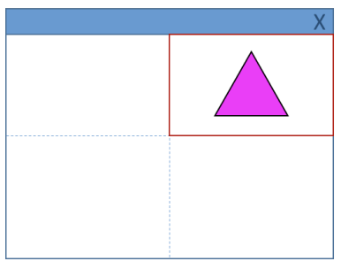
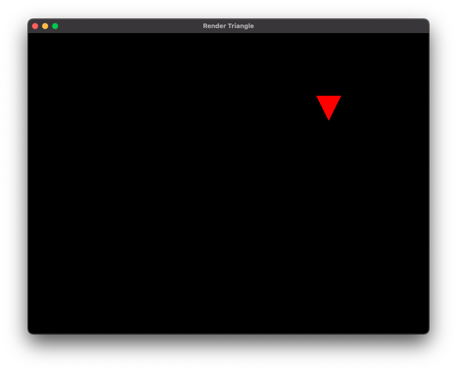
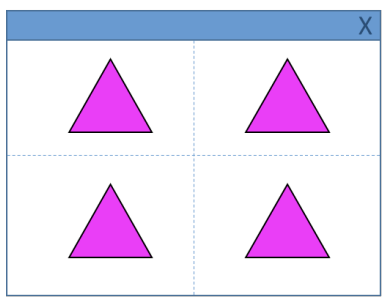
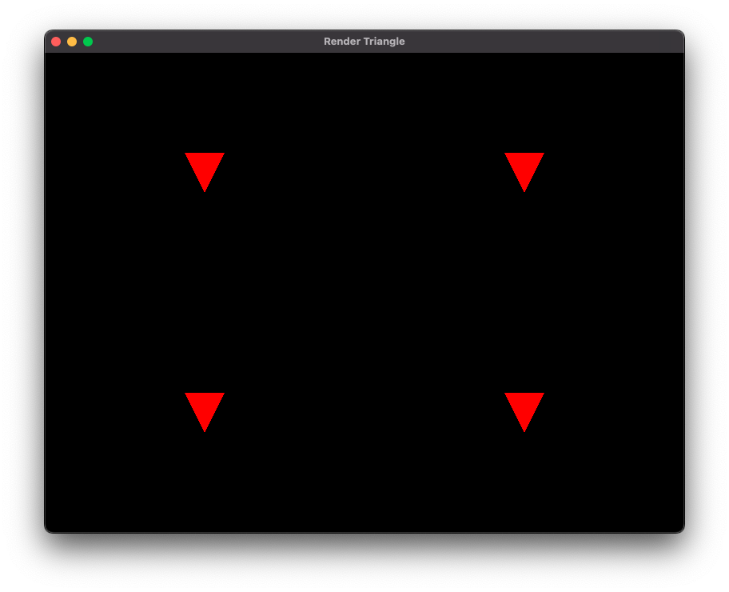

# Lista 2

## Questões práticas

### 1 - Modifique a janela do mundo (window/ortho) para os limites: `xmin=-10, xmax=10, ymin=-10, ymax=10`

[Código](./triangle/main.cpp#L65)

### 2 - Agora modifique para: `xmin=0, xmax=800, ymin=600, ymax=0`

[Código](./triangle/main.cpp#L71)

### 3 - Utilizando a câmera 2D do exercício anterior, desenhe algo na tela. O que acontece quando posicionamos os objetos? Por que é útil essa configuração?

Realizado desenhos das atividades 4 e 5. Essa configuração é útil para a área minima e máxima dos eixos, bem como definir o valor de cada ponto máximo

### 4 - Modifique o viewport para desenhar a cena apenas no seguinte quadrante da janela da aplicação 

[Código](./triangle/main.cpp#L92)

### 5 - Agora, desenhe a mesma cena nos 4 quadrantes 

[Código](./triangle/main.cpp#L99)

