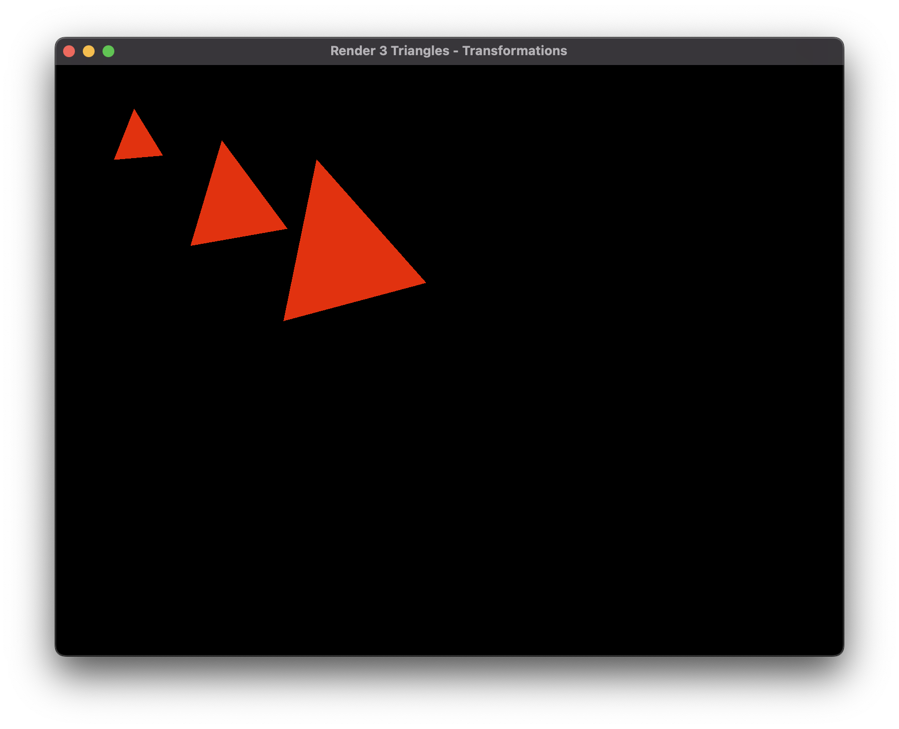
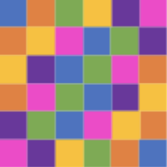
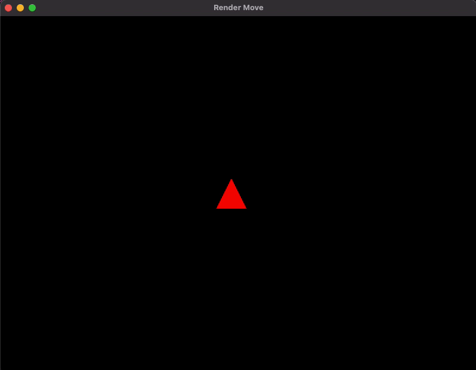
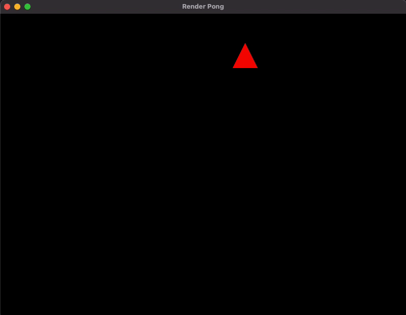

# Lista 3

## Questões práticas

### 1 - Desenhe uma mesma geometria 3 vezes na tela, aplicando transformações diferentes (mesmo VAO, matrizes de transformações diferentes, 3 chamadas de desenho)

[Código](./triangle/main.cpp#L84)

### 2 - Crie uma cena composta de quadrados coloridos dispostos em grid, como o exemplo abaixo

[Código](./grid/main.cpp#L98)

### 3 - Altere a posição de uma geometria (triângulo ou retângulo) nas 4 direções (cima, baixo, esquerda e direita) utilizando comandos de teclado para o controle (WASD ou setas)

[Código](./move/main.cpp#L18)

### 4 - (Desafio-extra) “Screensaver”: implemente um algoritmo que controle uma geometria (triângulo ou quadrilátero) com comportamento parecido com o do jogo “Pong” (quando atinge os limites da tela, espelha o vetor de direção)

[Código](./pong/main.cpp#L86)

